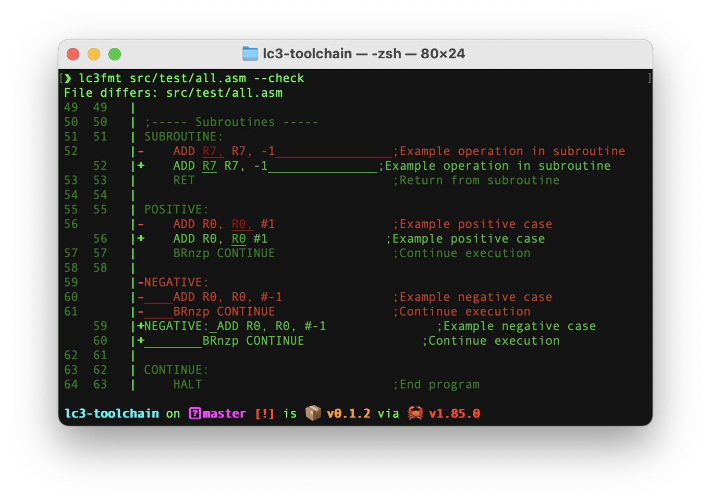
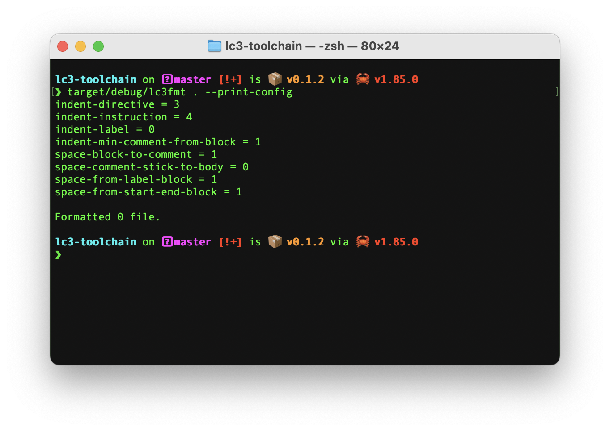

# lc3-toolchain


<div style="text-align: center;">
    
</div>

LC-3 Assembly Toolchain, this was originally designed for ECE109 Spring 2025, but can also be used anywhere else.

## Overview

`lc3-toolchain` contains a code `formatter` and `lint` tools specifically built for LC-3 assembly language.

## Installation

Download from release.

Or:
Cargo

```bash
cargo install lc3-toolchain
```

## Doc

### lc3fmt

Format lc3 code.

#### Usage

Basic usage:

```bash
lc3fmt <file_or_directory>
```

This will format the specified LC-3 assembly file or all assembly files in the given directory.

#### Command-line Options

##### `-c, --check`

Run in 'check' mode. Exits with 0 if input is formatted correctly.
Exits with 1 and prints a diff if formatting is required.

Validates files for proper formatting without making changes.
Useful for CI/CD pipelines or pre-commit hooks to ensure code style compliance.
Returns a non-zero exit code if any files need formatting.


##### `--config-path <path>`

Specifies a custom location for the configuration file. The tool will search for a `lc3-format.toml` file starting from
this path and moving up through parent directories. The configuration file controls formatting rules like indentation
style, comment alignment, and label positioning.

##### `--print-config`

Outputs the current configuration settings to standard output. Helpful for creating your own custom configuration file
by using this output as a starting point.



##### `--verbose`

Enables detailed output during the formatting process. Shows information about each file being processed, and any issues
encountered.

#### Configuration

Create a `lc3-format.toml` file to customize the linter's behavior:

```toml
[format-style]
indent-directive = 3
indent-instruction = 4
indent-label = 0
indent-min-comment-from-block = 1
space-block-to-comment = 1
space-comment-stick-to-body = 0
space-from-label-block = 1
space-from-start-end-block = 1
colon-after-label = true
fixed-body-comment-indent = false
directive-label-wrap = false
```

### lc3lint

Static analyzer and linter for LC-3 assembly code.

#### Usage

Basic usage:

```bash
lc3lint <file_or_directory>
```

This will analyze the specified LC-3 assembly file or all assembly files in the given directory for potential issues.

#### Command-line Options

##### `--config-path <path>`

Specifies a custom location for the configuration file. The tool will search for a `lc3-lint.toml` file starting from
this path and moving up through parent directories. The configuration file controls linting rules, severity levels, and
ignored warnings.

##### `--print-config`

Outputs the current configuration settings to standard output. Helpful for creating your own custom configuration file
by using this output as a starting point.

##### `--verbose`

Enables detailed output during the linting process. Shows information about each file being processed, and any issues
encountered.

#### Error Categories

lc3lint detects several categories of potential issues:

- **Syntax errors**: Invalid instructions or directives
- **Style issues**: Inconsistent formatting or naming conventions

#### Configuration

Create a `lc3-lint.toml` file to customize the linter's behavior:

```toml
[lint-style]
colon-after-label = false
label-style = "ScreamingSnakeCase"
instruction-style = "ScreamingSnakeCase"
directive-style = "ScreamingSnakeCase"
```

#### Exit Codes

- **0**: No issues found
- **1**: Issues found

## Contributing

Contributions are welcome! Please feel free to submit a Pull Request.

## License

GPL-v3
