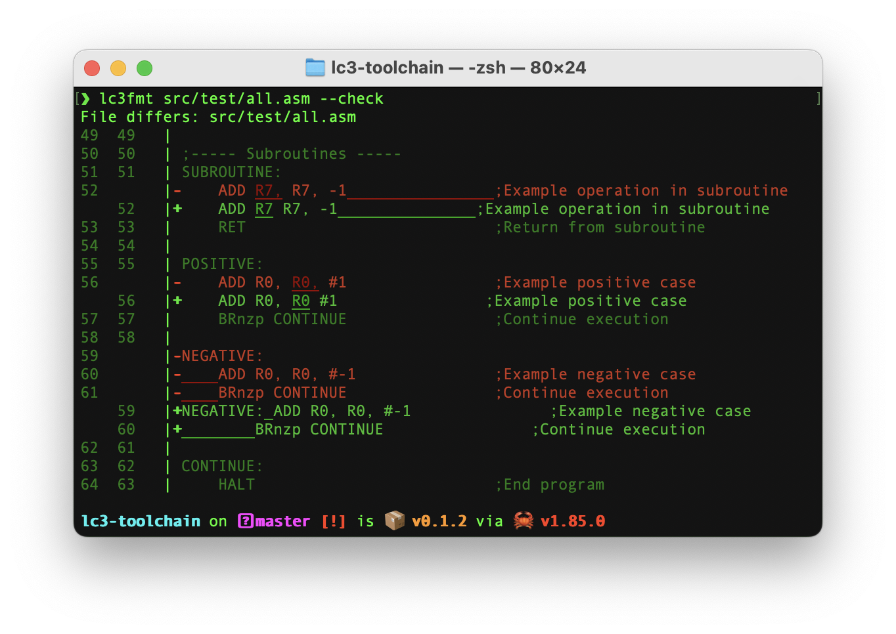
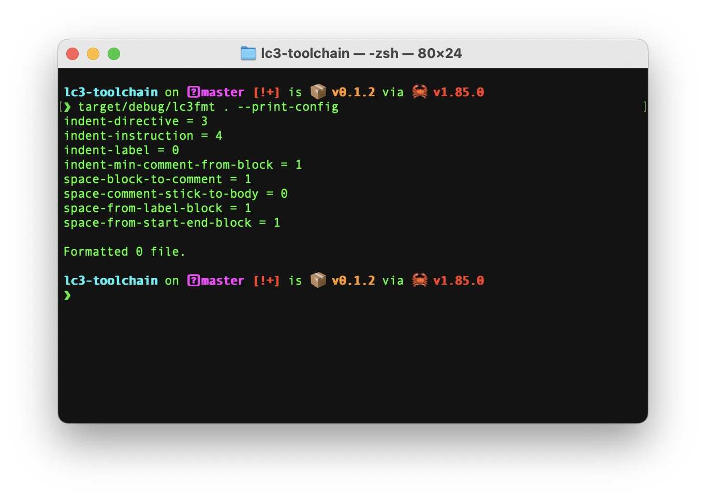

# lc3fmt

Format lc3 code.

## Usage

Basic usage:

```bash
lc3fmt <file_or_directory>
```

This will format the specified LC-3 assembly file or all assembly files in the given directory.

### Command-line Options

#### `-c, --check`

Run in 'check' mode. Exits with 0 if input is formatted correctly.
Exits with 1 and prints a diff if formatting is required.

Validates files for proper formatting without making changes.
Useful for CI/CD pipelines or pre-commit hooks to ensure code style compliance.
Returns a non-zero exit code if any files need formatting.



#### `--config-path <path>`

Specifies a custom location for the configuration file. The tool will search for a `lc3-format.toml` file starting from
this path and moving up through parent directories. The configuration file controls formatting rules like indentation
style, comment alignment, and label positioning.

#### `--print-config`

Outputs the current configuration settings to standard output. Helpful for creating your own custom configuration file
by using this output as a starting point.



#### `--verbose`

Enables detailed output during the formatting process. Shows information about each file being processed, and any issues
encountered.

## Configuration

Create a `lc3-format.toml` file to customize the linter's behavior:

```toml
[format-style]
indent-directive = 3
indent-instruction = 4
indent-label = 0
indent-min-comment-from-block = 1
space-block-to-comment = 1
space-comment-stick-to-body = 0
space-from-label-block = 1
space-from-start-end-block = 1
colon-after-label = true
```